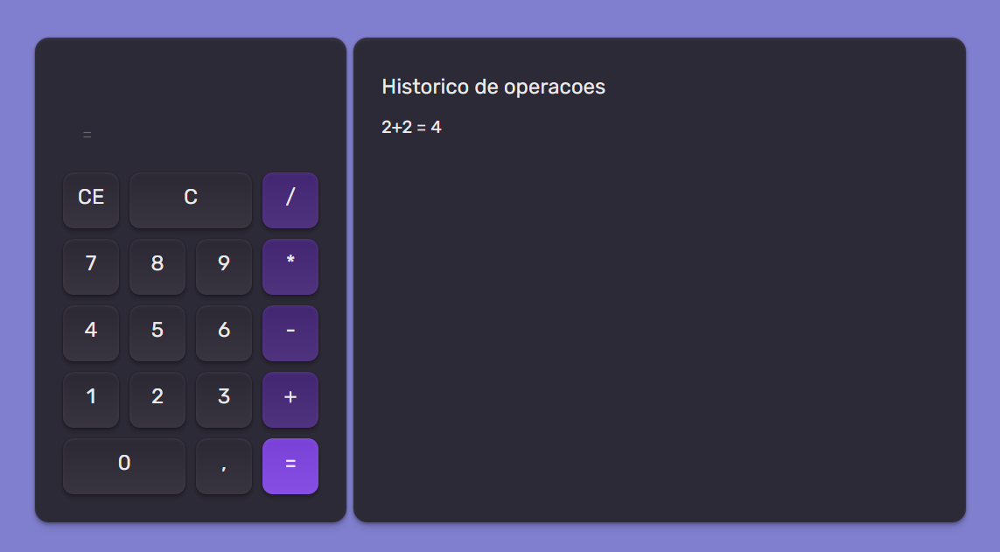

# 🚀Calculadora

Desafio inicial da formação React - Rocketseat.

Aplicação de calculadora com funções matemáticas básicas, que armazena os cálculos no Local Storage e exibe o histórico de operações realizadas. 

Para testar [Clique aqui!](https://marcosantonioferreira.github.io/react-2026-calculadora/)

## 🤖 Conceitos utilizados:

- Componentes;
- React wooks;
- Tailwind CSS;
- React Context;
- SPA

### Referência

Projeto criado, disponibilizado por - Rocketseat

 - [Rockeatseat](https://www.rocketseat.com.br/)

